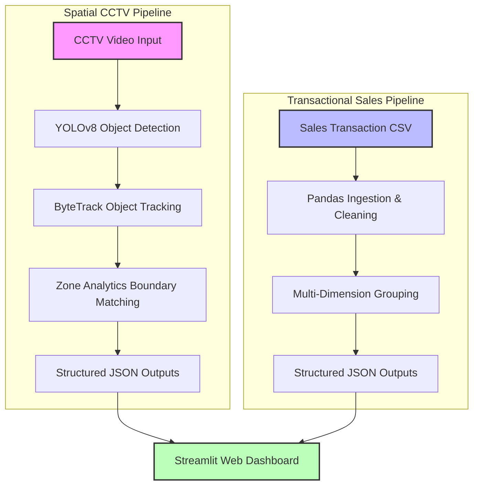

# Retail Visitor Analytics — System Design Document

This document outlines the system architecture, design decisions, and core implementations of the **Retail Visitor Analytics** platform. Designed for modern brick-and-mortar retail optimization, this system fuses real-time CCTV edge computer vision with transactional sales data to deliver deep business intelligence.

---

## Overview

The primary goal of **Retail Visitor Analytics** is to bridge the gap between **visitor behavior (foot traffic)** and **transactional performance (sales)**. 

In traditional retail, store managers only see the end of the funnel: purchase receipts. They remain blind to top-of-funnel analytics:
* How many people entered the store but didn't buy anything?
* Which sections (zones) of the store attract the most attention (dwell time)?
* Are customers ignoring the front display but crowding around the skincare section?
* How does employee scheduling or salesperson presence affect sales and customer engagement?

By utilizing **YOLOv8 detection**, **ByteTrack tracking**, **zone-based geometry containment**, and **Pandas-based transactional analytics**, this platform answers these questions, providing store owners with actionable insights to optimize floor layout, staff allocation, and marketing strategies.

---

## System Architecture

The platform operates on a decoupled two-pronged pipeline where spatial video analytics and tabular transaction analytics run independently, saving structured data outputs to a unified directory (`outputs/`), which are then consumed by a live Streamlit dashboard.



### CCTV Video Pipeline
`CCTV Video` $\rightarrow$ `YOLOv8 Detection` $\rightarrow$ `ByteTrack Tracking` $\rightarrow$ `Zone Analytics` $\rightarrow$ `JSON Outputs` $\rightarrow$ `Streamlit Dashboard`

1. **CCTV Video**: Standard high-resolution MP4 stream captured from overhead retail security cameras (e.g., CAM 1 and CAM 2).
2. **YOLOv8 Detection**: Real-time object detection processing frame-by-frame to identify person instances.
3. **ByteTrack Tracking**: Multi-object tracking (MOT) association that assigns consistent integer IDs across frames to handle occlusion and movement.
4. **Zone Analytics**: Polygon containment geometry checking that maps the coordinates of tracked persons to pre-defined business zones.
5. **JSON Outputs**: Multi-scale telemetry records, filtering invalid tracks, separating staff, and compiling zone dwell times.
6. **Streamlit Dashboard**: A high-fidelity, interactive control room that displays key performance indicators (KPIs), charts, and annotated footage previews.

### Sales CSV Pipeline
`Sales CSV` $\rightarrow$ `Pandas Analytics` $\rightarrow$ `JSON Outputs` $\rightarrow$ `Streamlit Dashboard`

1. **Sales CSV**: Operational transactional data exported from the store’s Point of Sale (POS) system.
2. **Pandas Analytics**: High-performance tabular transformation, resolving nulls, calculating net/gross values, and computing employee/brand metrics.
3. **JSON Outputs**: Summarized revenue aggregates, performance lists, and rankings.
4. **Streamlit Dashboard**: Visualizes sales performance tables and Plotly charts alongside customer analytics.

---

## CCTV Analytics Design

The CCTV analytics engine operates on top-down retail footage to capture physical engagement metrics.

### Person Detection
* **Model**: YOLOv8 Nano (`yolov8n.pt`) is selected for its high inference speed and low resource footprints, making it suitable for edge deployment.
* **Targeting**: Bounding boxes are filtered strictly to keep only the `person` class (Class ID `0`).
* **Parameters**: The confidence threshold is configured at `0.35` (optimizing the trade-off between false positives and missed detections), with an inference size of `640px`.

### Person Tracking
* **ByteTrack Integration**: Implemented via Ultralytics API (`model.track(tracker="bytetrack.yaml", persist=True)`).
* **Identity Retention**: Instead of resetting identities every frame, ByteTrack links detections by exploiting bounding box overlaps and motion predictions. This maintains a unique `person_id` across frames, even through short-duration occlusions or visual interruptions.

### Zone Assignment
The store floor is divided into spatial regions of interest (ROIs) representing key merchandise categories:
* **CAM1 Zones**: `skincare_wall`, `makeup_unit`, `mirror_area`, `front_display`
* **CAM2 Zones**: `skincare_wall`, `makeup_unit`, `mirror_area`, `front_display`

#### Containment Calculation
1. The **center point** of each detected person's bounding box is computed:
   $$\text{Center} = \left(\frac{x_1 + x_2}{2}, \frac{y_1 + y_2}{2}\right)$$
2. Using OpenCV's Ray-Casting algorithm (`cv2.pointPolygonTest`), the center point is evaluated against the vertices of the zone polygons.
3. If a point falls inside a zone's polygon, the person is marked as present in that zone.

### Dwell Time Calculation
Dwell time is the temporal duration (in seconds) that a unique visitor stays in a particular zone or inside the camera's view.

```
       [Enter Zone A]                     [Exit Zone A / Enter Zone B]
Frame:     F_entry  ===========================>  F_exit
                     (Dwell Time = (F_exit - F_entry) / FPS)
```

* **Transition & Tracking**: Entry and exit frames are recorded. When a person steps out of a zone, enters another, or disappears from the camera frame entirely, the active dwell interval is committed:
  $$\text{Dwell Seconds} = \frac{\text{Exit Frame} - \text{Entry Frame}}{\text{FPS}}$$
* **Flushing Mechanism**: If a person suddenly disappears (due to occlusion or exiting the camera field), their active zone time is automatically flushed and committed up to their last seen frame via `close_missing_tracks`.
* **Filtering & Denoising**: To filter out random passersby, transient shadows, and tracking glitches:
  * **Valid Person**: Must be tracked for at least **15 seconds** and **300 frames**.
  * **Strict Person**: Must be tracked for at least **30 seconds** and **600 frames**.
* **Staff Candidate Heuristic**: Staff members skew store-visitor engagement counts. To filter them out automatically, a heuristic is applied:
  * If a person's total visible duration is $\ge 30\%$ of the entire video length (or $\ge 60$ seconds) **and** their presence span (last seen frame - first seen frame) covers $\ge 50\%$ of the video duration, they are classified as a `staff_candidate`.
  * The dashboard filters out `staff_candidates` to ensure metrics represent true customers.

### Multi-Camera Support
* Parallel camera configurations run dynamically via the `--camera ALL` command-line argument.
* The script processes both streams sequentially, normalizes camera folder designations, generates camera-specific JSON summaries, and creates a consolidated store-wide summary (`combined_summary.json`).

---

## Sales Analytics Design

The sales analytics engine ([src/cctv_tracker/sales_analytics.py](file:///c:/Users/vipee/Desktop/study/yolo/src/cctv_tracker/sales_analytics.py)) processes the retail POS transaction file using Python's Pandas library.

### CSV Ingestion
* Ingests sales exports, standardizing columns, filling missing data (such as mapping blank brands, departments, or salesperson fields to `"Unknown"`), and converting values to clean numerical formats (`qty`, `GMV`, `NMV`).
* Identifies order boundaries by counting unique transaction values (`order_id` or `invoice_number`).

### Dimension-Level Aggregations
The engine groups the transactional dataframe across three dimensions:
1. **Brand Analytics**: Aggregates the quantity sold and Net Merchandise Value (NMV) per brand, sorting in descending order of revenue.
2. **Category Analytics**: Groups by department name (`dep_name`) to show department-level product category popularity.
3. **Salesperson Analytics**: Groups by employee name (`salesperson_name`) to rank staff members by total units sold and net revenue generated.

### Metrics Computed
* **Gross Merchandise Value (GMV)**: Total initial order value before discounts/refunds.
* **Net Merchandise Value (NMV)**: Net revenue generated.
* **Average Bill Value**: Net Merchandise Value / Total Orders.
* **Total Quantity**: Cumulative units sold.

---

## Dashboard Design

The UI ([dashboard/app.py](file:///c:/Users/vipee/Desktop/study/yolo/dashboard/app.py)) is a clean, dark-themed Streamlit application organized into three key sections:

```
┌────────────────────────────────────────────────────────┐
│  Store Analytics Dashboard (Sidebar Navigation)        │
├────────────────────────────────────────────────────────┤
│  [ CCTV Analytics ]  [ Sales Analytics ]  [ Combined ] │
├────────────────────────────────────────────────────────┤
│                                                        │
│  Metric Cards:  [Total People] [Dwell Time] [Top Zone] │
│                                                        │
│  ┌────────────────────────┐  ┌──────────────────────┐  │
│  │   Zone Dwell Time      │  │      Zone Share      │  │
│  │   [Bar Chart]          │  │      [Donut Chart]   │  │
│  └────────────────────────┘  └──────────────────────┘  │
│                                                        │
│  Data Frame:                                           │
│  [Zone Name] [Total Visits] [Total Dwell Time]         │
└────────────────────────────────────────────────────────┘
```

### CCTV Page
* Displays high-level cards representing customer traffic, total dwell time, and the top-performing zone for each camera.
* Integrates visual **Zone Layout Previews** (first-frame captures overlaid with custom colored zone polygons).
* Provides direct external hypermedia links to the full annotated video files hosted on Google Drive.
* Visualizes zone-level attention distributions side-by-side using interactive Plotly charts.

### Sales Page
* Contains top-level KPI metrics for transactional health (Total Orders, Total Quantity, Total GMV, Total NMV, and Average Bill Value).
* Renders interactive horizontal/vertical Plotly bar charts ranking performance for Brand, Category (Department), and Salesperson.
* Accompanied by interactive tabular data frames displaying rankings and volumes.

### Combined Overview
* Merges spatial and financial metrics to calculate multi-camera aggregates.
* Synthesizes store-wide zone dwell times into a single, cohesive foot-traffic engagement chart.
* Assists business owners in cross-referencing floor layout engagement with overall sales revenues.

### Visual Design Decisions
* **Harmonious Palettes**: Avoids harsh primary colors. Uses custom Plotly themes matching the zone overlays (e.g., deep orange for skincare, purple for makeup, teal for displays, red for mirrors).
* **Donut Charts**: Used specifically for Zone Share to display the percentage "share of attention" each region captures relative to the camera view.
* **Streamlit Layout**: Utilizes responsive columns (`st.columns`) for KPI cards and side-by-side charts, keeping information dense yet highly readable.
* **Robust File Handling**: Implements a loading layer that handles missing analytics files gracefully—showing user-friendly warning callouts instead of throwing application errors.

---

## Data Outputs

All processed files are generated within the `outputs/` directory. The following table describes the structural schema and purpose of each JSON data model:

| Filename | Data Schema / Key Fields | Purpose |
| :--- | :--- | :--- |
| `persons_cam1.json`<br>`persons_cam2.json` | List of objects: `camera_id`, `person_id`, `first_seen`, `last_seen`, `visible_duration_seconds`, `frame_count`, `valid_person`, `staff_candidate` | Complete registry of tracked people with entry/exit timestamps, filtering flags, and staff candidates. |
| `summary_cam1.json`<br>`summary_cam2.json` | `unique_people`, `staff_candidates`, `customer_candidates` | Summary of customer vs. employee counts for the specific camera. |
| `summary_raw_cam1.json`<br>`summary_raw_cam2.json` | `track_ids` (List), `raw_tracks` (Int) | Diagnostic file containing all initial tracked IDs before applying the minimum duration filter. |
| `summary_filtered_cam1.json`<br>`summary_filtered_cam2.json` | `person_ids` (List), `filtered_people` (Int) | List of IDs passing the standard `15-second / 300-frame` visitor threshold filter. |
| `summary_strict_cam1.json`<br>`summary_strict_cam2.json` | `person_ids` (List), `filtered_people` (Int) | List of IDs passing the stricter `30-second / 600-frame` filter, isolating highly engaged shoppers. |
| `person_ranking_cam1.json`<br>`person_ranking_cam2.json` | List of objects: `camera_id`, `person_id`, `visible_duration_seconds`, `frame_count` (Sorted Descending) | Ranks store visitors by absolute visibility duration to evaluate outliers and high-dwell customers. |
| `zone_analytics_cam1.json`<br>`zone_analytics_cam2.json` | List of objects: `camera_id`, `person_id`, `zones` (Map of zone $\rightarrow$ seconds), `zone_visits` (Map of zone $\rightarrow$ count) | Person-by-person spatial footprint mapping which zones they visited and how long they lingered. |
| `zone_summary_cam1.json`<br>`zone_summary_cam2.json` | Map of Zone Name $\rightarrow$ `{total_visits, total_dwell_seconds}` | Aggregated spatial performance statistics used to draw the charts and compute top store locations. |
| `top_zones_cam1.json`<br>`top_zones_cam2.json` | `most_visited_zone`, `least_visited_zone` | Identified maximum and minimum foot-traffic regions based on combined visits and dwell time. |
| `combined_summary.json` | `camera_count`, `total_people`, `total_staff_candidates`, `total_customer_candidates`, `total_dwell_seconds`, `cam1_people`, `cam2_people`, `zones` (Aggregated Maps) | Store-wide combined visitor analytics merging CAM1 and CAM2 spatial footprints. |
| `sales_summary.json` | `total_orders`, `total_qty`, `total_gmv`, `total_nmv`, `average_bill` | Overall transactional store KPIs extracted from the sales records. |
| `brand_summary.json` | List of objects: `brand_name`, `total_qty`, `total_nmv`, `ranking` | Leaderboard tracking brand sales performance, sorted in descending order of net revenue. |
| `category_summary.json` | List of objects: `dep_name`, `total_qty`, `total_nmv`, `ranking` | Department-level sales performance tracking products by category. |
| `salesperson_summary.json` | List of objects: `salesperson_name`, `total_qty`, `total_nmv`, `ranking` | Sales representative performance metrics, ranking personnel contribution to net revenue. |

---

## AI-Assisted Decisions

Artificial Intelligence played a key role in accelerating development and improving code quality throughout this project.

### Code Generation
* **Object Association**: Guided the integration of YOLOv8 and ByteTrack inside the frame processing generator loop to yield structured tracker dictionaries.
* **Geometry Containment**: Generated mathematical checking modules utilizing OpenCV contours and polygon inclusion tests (`cv2.pointPolygonTest`).
* **Pandas Transformations**: Authored optimized pandas routines to group, aggregate, and rank sales parameters.

### Refactoring
* **Modularity**: Refactored monolithic track processing code in `cli.py` into distinct helper files and functions (e.g., separating frame visualization, zone checking, and file serialization).
* **Schema Standardization**: Unified JSON schemas across different analytics boundaries, ensuring that keys and formats aligned consistently between the CCTV CLI engine and the Streamlit dashboard.

### Dashboard Development
* **Interactive Layouts**: Designed the grid structure of the Streamlit app, utilizing side-by-side columns to render data tables next to their corresponding charts.
* **Robust Error Boundaries**: Suggested wrapping file reads with robust verification layers (`load_json_file`) to keep the dashboard stable even if CCTV files are deleted or are still processing.

### Analytics Design
* **Staff Candidate Heuristic**: Assisted in designing logic to distinguish employees from customers, preventing long-duration staff tracking from skewing retail visitor dwell metrics.
* **Frame Skipping (Stride)**: Designed the variable frame-skipping algorithm (`--skip-frames`), which increases performance during video parsing by skipping redundant frames while scaling timestamps and dwell calculations accurately.

### Documentation Assistance
* **Technical Writing**: Assisted in structured formatting, drawing Mermaid pipelines, designing schema tables, and formatting the installation commands, creating a clean technical document.
